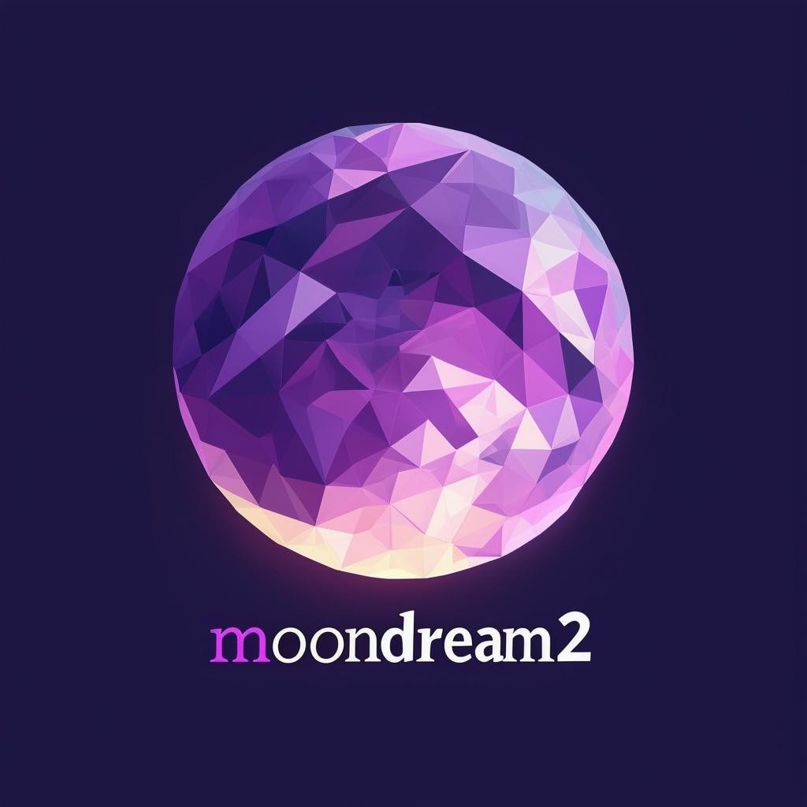

# Moondream2 Poe Bot

This repository contains the code for a Poe bot powered by the Moondream2 model. Moondream2 is a large language model capable of understanding and generating text, as well as comprehending images.

## Features

**Text and Image Understanding**: The bot can process and interpret both text and image inputs, allowing for richer and more nuanced interactions.

**Creative Text Generation**: Powered by Moondream2's language capabilities, the bot can generate creative text formats, translate languages, write different kinds of creative content, and answer your questions in an informative way.

**Image Description and Analysis**: The bot can describe the content of images and provide insights or answer questions related to them.

## Usage

To interact with the bot, you will need to have access to the Poe platform. Once you have access, you can add the bot to your chat list and start a conversation. You can provide both text and image inputs to the bot, and it will respond accordingly.

## Technical Details

Model: The bot utilizes the Moondream2 model for text and image understanding and generation.

Framework: The bot is built using the fastapi-poe library, which provides a convenient way to develop and deploy Poe bots.

Deployment: The code is deployed on Modal, a platform for running serverless functions.

## Requirements

To run the bot locally, you will need to install the required dependencies:

```bash
pip install fastapi-poe==0.0.28 requests transformers einops huggingface-hub accelerate pillow torch torchvision
```

Use code with caution.

## Disclaimer

The bot is still under development, and its responses may not always be perfect. However, it is continuously learning and improving.

## License

This project is licensed under the MIT License. See the LICENSE file for details.